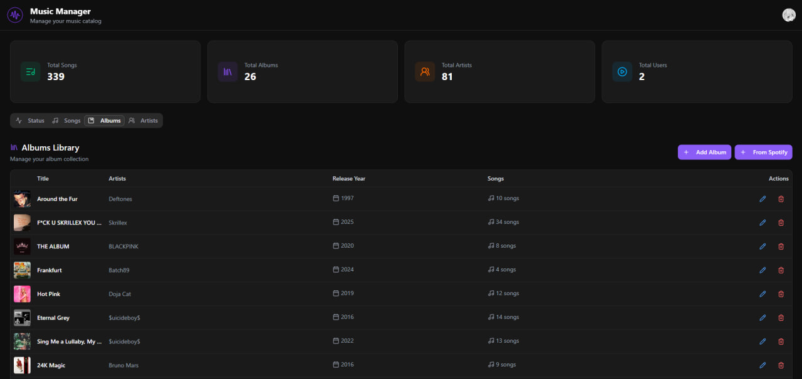

# Moodify CMS

**Moodify CMS** is the administration panel for the **Moodify Music** platform.  
It allows managing and monitoring the backend services, analyzing audio features, and maintaining the entire music catalog.

---

## 🚀 Features

- **Backend & Analysis Monitoring**  
  Check the operational status of the main backend and the audio analysis service directly from the dashboard.

- **Full CRUD System**  
  Manage **Tracks**, **Albums**, and **Artists** with a clean and intuitive interface.

- **Automatic Spotify Importer**  
  Upload full albums automatically by providing a **Spotify album URL** and a **ZIP archive** with the audio files.

- **Authentication via Firebase**  
  Secure access and user management handled through Firebase Authentication.

- **Modern Stack**  
  - **Frontend:** React + TypeScript  
  - **Database:** MongoDB  
  - **API:** Hosted within the main Moodify Music project  

---

## 🛠️ Tech Stack

| Category | Technology |
|-----------|-------------|
| Frontend | React, TypeScript |
| Backend | REST API (Moodify Music) |
| Database | MongoDB |
| Auth | Firebase Authentication |
| External APIs | Spotify API |
| Version Control | Git + GitHub |
